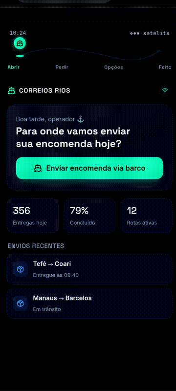

# Correios Rios — Protótipo de envio via barco



Protótipo funcional (React + Vite) de uma nova experiência de envio de encomendas para a logística fluvial na Amazônia — pensado para uma agência flutuante dos Correios.

**🔗 Deploy:** [correios-rios.vercel.app](https://correios-rios.vercel.app/)

---

## Sobre o projeto

A ideia original do **LogAmazonia** — repensar o envio de encomendas via barco em regiões ribeirinhas da Amazônia, onde não existe malha rodoviária e o rio *é* a estrada — nasceu de um grupo de estudantes do Senai, que levou a proposta a um instrutor da instituição em busca de ajuda para tirá-la do papel.

O instrutor organizou um desafio entre **3 duplas**, que competiram entre si para criar o melhor protótipo para a ideia delas, com **vibecoding** (desenvolvimento assistido por IA), do zero ao deploy, em **2 dias** (25 e 26/08/2026).

Este repositório é o protótipo que desenvolvi nessa competição. Em vez de tentar construir um app completo, o foco foi validar **um fluxo de ponta a ponta**, bem executado, simulando como a IA poderia apoiar a decisão de rota considerando nível dos rios, clima e tráfego fluvial.

### Fluxo implementado

```
Abrir app → Pedir envio → Opções de entrega → Pedido feito
```

1. **Pedir envio** — o usuário informa porto de origem/destino, tipo de encomenda (documento, pacote pequeno, pacote grande ou carga) e peso.
2. **Opções de entrega** — a IA simula uma análise de nível dos rios, clima e tráfego fluvial e sugere 3 rotas com tempo estimado, % de confiança e preço (Rota Prioritária, Secundária e Alternativa).
3. **Pedido feito** — confirmação com código de rastreio, resumo do trajeto, tipo, peso, previsão de chegada e valor.

Todas as telas seguem um indicador de progresso fixo no topo (Abrir → Pedir → Opções → Feito), reforçando ao usuário em qual etapa do fluxo ele está.

---

## Rodando localmente

Pré-requisitos: **Node.js 18+** instalado.

```bash
npm install
npm run dev
```

Abra o endereço que aparecer no terminal (normalmente `http://localhost:5173`).

### Build de produção

```bash
npm run build
npm run preview
```

---

## Estrutura

```
src/
  App.jsx      -> todo o fluxo (4 telas) e estilos
  main.jsx     -> ponto de entrada React
index.html
```

---

## Stack

- React 18
- Vite
- lucide-react (ícones)

---

## Escopo e próximos passos

Este é um protótipo de **fluxo único**, não um app completo — decisão consciente para validar a ideia rapidamente dentro do prazo do desafio. Ideias para evolução futura:

- Persistência real de pedidos (hoje o fluxo é simulado, sem backend)
- Integração com dados reais de nível dos rios e previsão do tempo
- Tela de acompanhamento de entrega em tempo real
- Autenticação de usuário e histórico de encomendas

---

## Contexto

Projeto desenvolvido em uma competição de vibecoding entre 3 duplas, proposta por um instrutor do Senai a partir da ideia original de um grupo de estudantes (o LogAmazonia), com apoio de IA em todas as etapas — do protótipo de interface ao versionamento e deploy.
